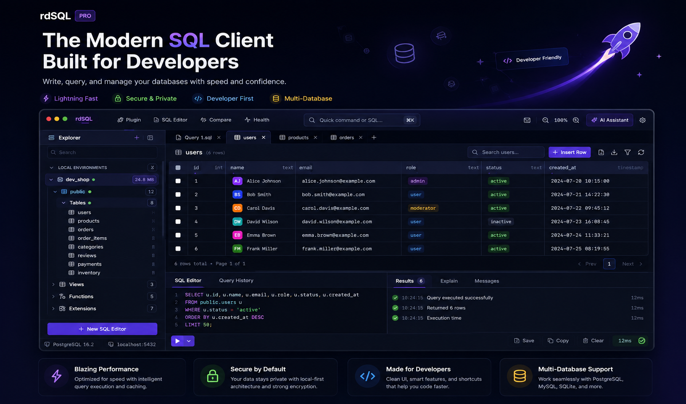
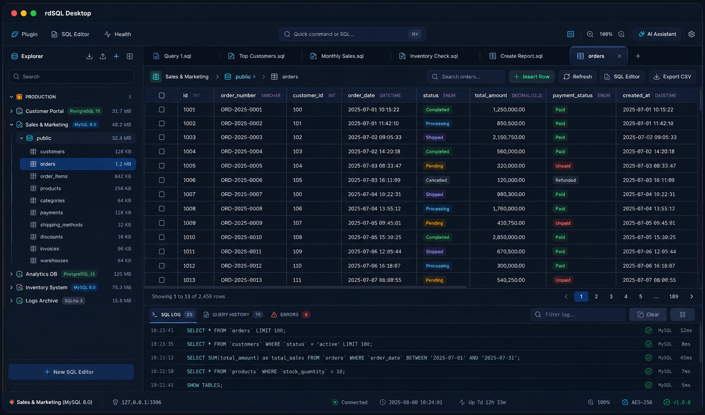
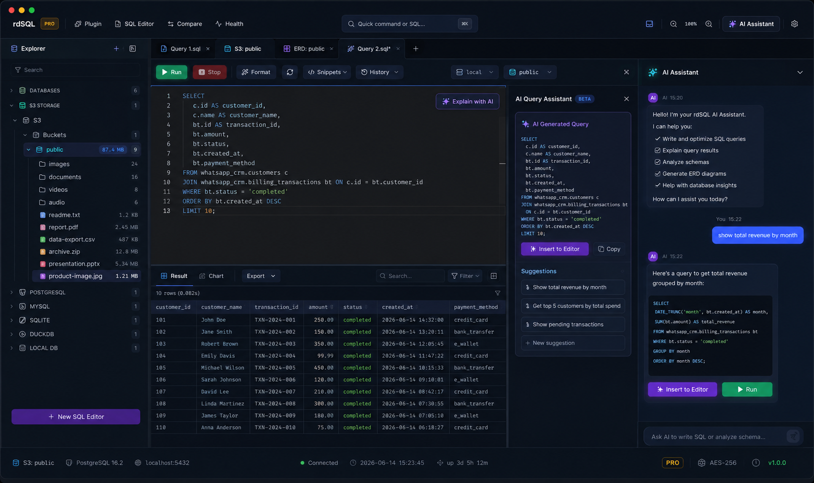
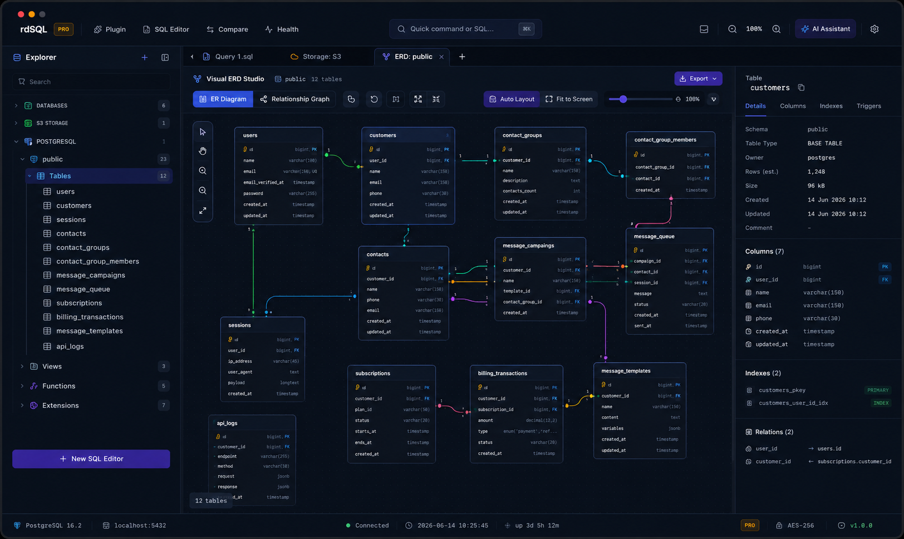
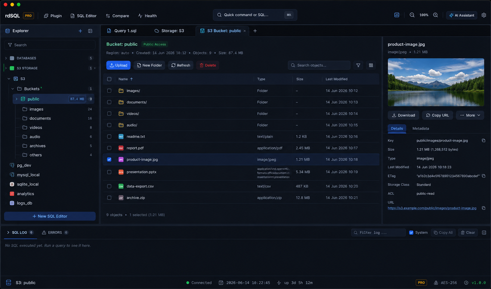

# rdSQL Desktop — Modern Database Workspace

<div align="center">


**A modern AI-powered database workspace designed for developers.**

[Website](https://rdsql.com) · [Documentation](https://rdsql.com/docs) · [Tutorials](docs/tutorials) · [Releases](https://github.com/rdsqlhq/rdsql/releases) · [Bug Reports](https://github.com/rdsqlhq/rdsql-community/issues/new?template=bug_report.yml) · [Feature Requests](https://github.com/rdsqlhq/rdsql-community/issues/new?template=feature_request.yml) · [Community](https://github.com/rdsqlhq/rdsql-community)

</div>

---

## 🌟 Overview

**rdSQL Desktop** is a native, ultra-fast, and lightweight database workspace powered by **Tauri v2 + Rust** and **React 19 + Vite**.

It provides a flagship developer experience for:
- 🗄️ **Database Development & Execution** — SQL editor, table explorer, query results grid
- 📊 **Visual ERD Studio** (Interactive schema canvas powered by `@xyflow/react`)
- 🔀 **Migration Studio** (Environment schema diffing & versioning)
- 💾 **Native Backup & Restore** (High-performance compressed SQL dumps using Rust workers)
- ☁️ **S3-Compatible Object Storage Browser** (AWS S3, Cloudflare R2, MinIO)
- 🤖 **AI Assistant** (SQL generation, query optimization, and schema explanation)
- 🔄 **Encrypted Cross-Device Sync** (connections and credentials, end-to-end encrypted)

---

## 🗄️ Supported Databases

| Engine | | Engine | |
|---|---|---|---|
| PostgreSQL | ✅ | MariaDB | ✅ |
| MySQL | ✅ | TiDB | ✅ |
| SQLite | ✅ | PlanetScale | ✅ |
| DuckDB | ✅ | CockroachDB | ✅ |
| Cloudflare D1 | ✅ | YugabyteDB | ✅ |

---

## 📸 Screenshots

<div align="center">



| SQL Editor & Explorer | AI Database Assistant |
| :---: | :---: |
|  |  |

| Visual ERD Studio | S3 Object Storage Browser |
| :---: | :---: |
|  |  |

</div>

More screenshots land in [`screenshots/`](screenshots/) as new views ship.

---

## 🚀 Tech Stack

- **Desktop Framework**: Tauri v2 + Rust
- **Frontend Engine**: React 19, TypeScript, Vite
- **Styling**: TailwindCSS, CSS Glassmorphic design tokens
- **SQL Editor**: Monaco Editor (`@monaco-editor/react`)
- **Data Grid**: TanStack Table
- **Diagramming Canvas**: React Flow (`@xyflow/react`)
- **State Management**: Zustand
- **Native Security**: OS Keyring (session tokens, sync key material) + AES-256-GCM (S3 secrets, cloud sync credentials). Database connection passwords in local storage are not yet keyring-backed — that migration is tracked separately.

---

## 📥 Installation

Download the latest installer for your platform from **[rdsql.com/download](https://rdsql.com/download)**
or the **[GitHub Releases](https://github.com/rdsqlhq/rdsql/releases)** page (macOS, Windows, Linux).
The app checks for updates automatically after install.

## 📚 Documentation & Tutorials

- Full docs: **[rdsql.com/docs](https://rdsql.com/docs)**
- Step-by-step guides: **[docs/tutorials](docs/tutorials)** — connecting a database, the SQL editor,
  the database explorer, ERD studio, the S3 browser, and the AI assistant.

## 🛠️ Getting Started (Build from Source)

### Prerequisites

- [Node.js](https://nodejs.org/) v18+
- [Rust & Cargo](https://www.rust-lang.org/) v1.75+

### Installation & Run

```bash
# Clone the repository
git clone https://github.com/rdsqlhq/rdsql.git
cd rdsql

# Install npm dependencies
npm install

# Start Vite dev preview
npm run dev

# Run Tauri v2 desktop app locally
npm run tauri dev
```

### Build Desktop Application

```bash
make release          # optimized build + installer for this machine
make show-artifacts   # list what was produced
```

---

## 🚢 Releasing

Releases are tag-driven: `make publish` pushes a `v*` tag, CI builds macOS
(Intel + Apple Silicon), Windows, and Linux installers, and the app updates
itself in place via the Tauri updater.

```bash
make bump V=1.0.1                          # sync the version everywhere
git commit -am "chore: release v1.0.1"
make publish                               # tag + push → CI builds
make release-publish                       # un-draft once CI is green
```

See **[RELEASE.md](RELEASE.md)** for the full process, the signing-key handling,
and troubleshooting. `make help` lists every target.

---

## 🤝 Contributing

Contributions are welcome! Please read **[CONTRIBUTING.md](CONTRIBUTING.md)**
for dev setup, project layout, quality checks, and the PR process. Everyone
participating is expected to follow the **[Code of Conduct](CODE_OF_CONDUCT.md)**.

## 💬 Community & Support

- 🐛 **[Report a bug](https://github.com/rdsqlhq/rdsql-community/issues/new?template=bug_report.yml)**
- 💡 **[Request a feature](https://github.com/rdsqlhq/rdsql-community/issues/new?template=feature_request.yml)**
- 💭 **[Discussions](https://github.com/rdsqlhq/rdsql-community/discussions)**
- 🌐 **[rdsql.com](https://rdsql.com)**

All community activity (issues, discussions, product updates) happens in the
**[rdSQL Community repository](https://github.com/rdsqlhq/rdsql-community)** — this repo is for
code, releases, and public documentation.

---

## 📄 License

MIT License © rdSQL Team — see **[LICENSE](LICENSE)** for the full text.
